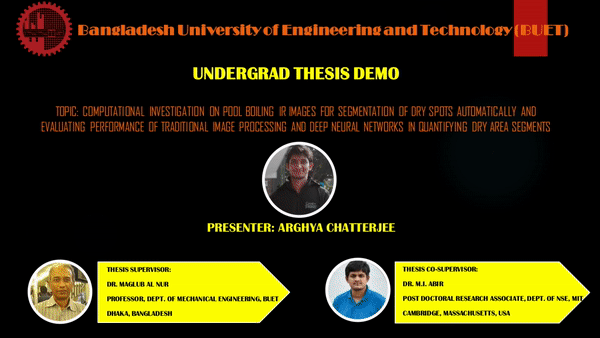

# U-Net for Nuclear Thermal IR Image Segmentation
The work was performed as part of my BSc. thesis at Bangladesh University of Engineering and Technology with the data from MIT NSE's Thermal Nuclear Reactor in 2019.

## Update:
An upgraded version of UNet in pytorch has been released as part of the ISR departmental project at UWF. The previous version for training and testing the UNet was in tensorflow.

## Thesis Topic:
- Computational Investigation on Pool Boiling IR Images for Segmentation of Dry Spots Automatically and Evaluating the Performance of Traditional Image Processing and Deep Neural Networks in Quantifying Dry Area Segments.

## Demonstraion:
- Here is a short demonstration of my work. For better quality, see the demo on [youtube](https://www.youtube.com/watch?v=Px55bKnRF9A). 
<p align="center">
    
</p>

## Introduction:
Qualitative as well as quantitative performance of different image processing and CNN-based automatic methods with manually segmented results on Pool Boiling Infra-Red images has been performed by measuring important boiling heat transfer parameters statistically for each scheme.

## Deep Neural Network For Dry Spot Segmentation:
### Run with pytorch (New version):
With the pytorch version, here is how you can train the model:
```
git clone https://github.com/ArghyaChatterjee/unet-nuclear-thermal-ir-image-segmentation.git unet_ir_img_seg
cd unet_ir_img_seg/pytorch_version
python3 unet_training.py
```
Give proper input and output directory paths before running training script.

In order to test the model with manually labeled Ground Truth segmented images, run:
```
python3 unet_testing.py
```
Don't forget to specify the dataset input folder paths for testing.

### Run with Tensorflow in ipynb (Old version):
```
git clone https://github.com/ArghyaChatterjee/unet-nuclear-thermal-ir-image-segmentation.git unet_ir_img_seg
cd unet_ir_img_seg
```
- Download and Install anaconda distribution from here: https://www.anaconda.com/.
- Source the environment variables for anaconda. Files attached here are python programs written & compiled inside jupyter notebook which is an editor & shareable compiler of anaconda distribution. 
- Download and install Keras and Tensorflow (Machine Learning Framework & Library developed by Google). You can download tensorflow from here: https://www.tensorflow.org/. 
- Put the training dataset inside 'Input/train' folder and manually segmented dataset inside 'Input/mask' folder. Then run the 'train.ipynb' file cell by cell. When you run the last cell,the program will start to generate a weight file at each epoch. The weight files will be stored inside 'weights' folder. Keep the best weight file (usually the last one) and delete the rest of them.
- Put the testing dataset inside 'Input/test' folder. You have to specify the best weight file name that you created in the previous segment in this line 'model.load_weights('weights/unet_256_arghya.275-0.03243-0.96508.h5')' inside Test.ipynb file. By default, a weight file is included inside 'weights' folder of this repository which was generated after 275 epochs of training. 
- After running the last cell of 'Test.ipynb' file, you will get your segmented images inside current folder.
- You can do several types of analysis with your segmented results ( by Image Processing and DCNN) using MIPAR. 
- You can plot the data (which you generated from MIPAR) using 'Data related graph plots.ipynb' file and visualize the plots using matplotlib. 

## Image Processing (IP) For Dry Spot Segmentation:
### Download Software:
- Download MIPAR software from the following link: https://www.mipar.us/
### Simple IP Operation:
- Load images inside MIPAR. 
- We first try a simple E-M thresholding based image processing technique to evaluate the segmentation performance. Image specific parameter tuning is essential as E-M thresholding is prone to detect background noise uniquely in each image. We use 8-pixel connectivity (face-based) for all images to determine local minima as the basis for the E-M threshold. 
- We set maximum difference of threshold pixel intensities to 38, 37, 25, 22, 40 and 26 against 600 kW/m^2 Heat Flux (HF) frame ids respectively; 26, 19, 23, 20, 28 and 29 against 700 kW/m^2 HF frame ids respectively; 24, 31, 28, 23, 34 and 21 against 800 kW/m^2 HF frame ids respectively; 38, 33, 30, 41, 35 and 58 against 900 kW/m^2 HF frame ids respectively and 38, 47, 36, 36, 43 and 40 against 1100 kW/m^2 HF frame ids respectively. 
- This parameter sets the maximum difference of threshold pixel intensities from the nearest local minima in order to be grouped into that minima's region.
  
### Complex IP Operation:
- A simple E-M threshold based segmentation method doesn’t provide accurate segmentation on a set of images. Therefore, several image processing steps are applied to obtain better segmentation performance. First, a contrast adjustment operation is performed on initial image to enhance dry spots relative to background. 
- A Non-Local Means Filtering operation is performed afterwards to make the background smooth. The pixel window size is set to 2 which is the size of neighborhood pixels considered about each pixel for the filter, and strength parameter is set to 0.096 which is a factor that controls the strength of the filter. 
- Then Adaptive Gaussian Thresholding operation is performed to initially segment the dry spots from their background. Again, the pixel window size is set to 6, select is set to dark and percentage value is set to 48.78% which means if a pixel is less than 48.78% of the average grayscale value in a 6 × 6 pixel window centered around it, it will be selected. 
- Morphological Erosion operation performed afterwards to remove background noise from binary segmented image. Threshold parameter is set to 5 which is the minimum number of empty pixels that must surround a selected pixel for it to be removed, and iterations is set to 10 which is the number of iterations to perform the erosion. However, erosion operation decreases the amount of dry areas. 
- Therefore, Morphological Dilation operation is performed to dilate the segmented dry spots in order to complement the loss of segmented areas in previous operation. The depth parameter is set to 3 which is the number of pixels by which selected regions will be grown in all directions.

## GroundTruth Formation (Manually Labeling)
- Input images used in this work for both image processing, DCNN training and testing comprise of five time-lapse heat flux datasets ranging from 600, 700, 800, 900 and 1100 kW/m​2​.
- Each set of images consists of 12,500 images. The dimension of each image is of 70 ​× ​175 pixels(height​ × ​width). We have resized the images to 256 ​× ​256 pixels for better viewing during manual segmentation with MIPAR as well as for ease of processing due to training architecture limitation.
- We discard 20 images from the beginning and 30 images from the end of each dataset because boiling has not started yet in the first few images and the last few images are noisy. Therefore, we discard a total of 50 images to make a total of 12,450 images in each dataset.
- A total of 300 ground truth segmentation maps were annotated for training purposes from these 5 image datasets(80 images each from 600 kW/m​2​, 900 kW/m​2 and 1100 kW/m​2 batch, and 30 images each from700 kW/m​2 and 800 kW/m​2 batch) and 30 additional ground truth segmentation maps were created for testing purpose (6 images from each heat flux dataset mentioned above).
- We also confirm that the training images are not included in the testing images.
- The image data and corresponding labeled data were subjected to data augmentation to create the final dataset for training the DCNN which consists of several spatial transformations such as flipping, scaling, reflection, rotation, and translation.30 test images from 5 different datasets mentioned above are taken randomly.
- From 600 kW/m​2dataset, selected frame ids are 120, 720, 11420, 11520, 11920 and 12020. From 700 kW/m​2dataset, selected frame ids are 20, 21, 22, 23, 63 and 64. From 800 kW/m​2 dataset, selected frame ids are 218, 236, 272, 362, 524 and 722. From 900 kW/m​2 dataset, chosen frame ids are 120,320, 820, 11420, 11720 and 11920. Finally, from 1100 kW/m​2 dataset, chosen frame ids are 720, 1120, 1320, 11420, 11520 and 11920.  
  
## Deep Convolutional Neural Network Architecture  
- The input images are single-channel grayscale IR images and the output images are binary segmentation maps in which the black pixels correspond to the dry areas, and the white pixels correspond to the background. 
- Each contracting path consists of two consecutive 3×3 padded convolutions. Each convolution follows a batch normalization and a rectified linear unit (ReLU) and a 2×2 max pooling operation with stride 2 for downsampling. This step not only extracts advanced features but also reduces feature map size. The first subsection in the U-net network consists of 32 output channels. The output channels double the number in each subsequent subsections. The expansive path up samples the feature maps followed by 2×2 up-convolution, concatenated feature map from the contracting path, three 3×3 convolutions, each followed by a ReLU. A 1×1 convolution is used at the final layer to map feature vectors to the desired number of classes (i.e. 1). 
- The images were resized into 256×256 pixels to obtain an even size layer. During training, the training dataset was further divided into training and validation set. 
- We chose 10% of our training data as a validation set (i.e., 30 images from 300 training images). The network is trained on 270 training images and evaluated by 30 validation images. 
- The network is trained for 275 epochs using binary cross-entropy loss and optimized using Adam optimization with a learning rate of 0.01. After training, the test set is used to evaluate the trained model.
  
## Software and Hardware Specification:
- We demonstrate the application of Traditional Image Processing operations and U-net DCNN for detection as well as quantification of dry area from pool boiling data. 
- We used free version of a well known software used for segmentation called MIPAR for all image processing operations and construct the DCNN using python in jupyter notebook with frontend Keras (a high-level neural networks API capable of running on top of Tensorflow, CNTK or Theano) and backend Tensorflow (a low level open source deep learning library). 
- We train the images on CPU memory with processor Intel(R) Core(TM) i7-4510U running at 2.3 GHz and 8GB RAM on Windows 10 operating system. The training of 270 images and validation of training result on 30 images upto 275 epochs took 4 days and 5 hours on the CPU architecture mentioned above. Each epoch took an average of 22 minutes and each step per epoch took an average of 29.3 seconds (45 steps per epoch).
  
## Statistics and Analysis:
- The mean and standard deviations of dry area fraction, bubble frequency and density of 6 random images from each batch (5 batches in total) were calculated using MS Excel, files were converted into CSV (Comma Separated Value) format, imported in jupyter notebook using python and visualized using matplotlib. 
- The data augmentation operation before training the neural network was performed using specialized algorithm written in python and compiled in jupyter notebook. The semi-automatic Ground Truth was formed using trial version of MIPAR software.
  
## Data Availability:
- The time-lapsed high speed pool boiling IR image dataset used in this study unfortunately is not open source and one needs special permission to use this dataset as the dataset is produced inside expensive experimental setup of MIT’s Nuclear Reactor Laboratory.
  
## Special Thanks:
- Special thanks to my respectable supervisor Dr. Maglub Al Nur, Professor of Mechanical Engineering Department at Bangladesh University of Engineering and Technology (BUET), for providing me the opportunity to work on this topic and keeping faith in me that I can complete such a delicate task within this one year time period. His continuous support, motivation, friendly behaviour and pragmatic idea backed by helpful mentality really made this work as it is till now.
- Dr. Abir who is a Postdoctoral Research Associate at the Department of Nuclear Science and Engineering in Massachusetts Institute of Technology (MIT) and a co-supervisor of this work, provided constant support, guidance and resources during this work for which I am grateful to him. 
- Special thanks to Dr. Matteo Bucci, Professor of Nuclear Science and Engineering Department at Massachusetts Institute of Technology (MIT). He allowed me to use some of his lab data from their Expensive Setup inside Nuclear Reactor Laboratory for which I am grateful to him.
- Special thanks to MIPAR community for their support. They extended their trial version for me on my request. Their software was pretty helpful in all the image processing and post data processing operations inside my thesis.
  
## Citation:
- One who has access to the dataset can use the code to reproduce the result published in my undergrad thesis. You can find my undergrad thesis here: https://www.researchgate.net/publication/333371480
- If you want to cite the code, please add the doi number to the reference section of your research paper:
      [](https://zenodo.org/badge/latestdoi/224518388)
- If you want to cite this thesis, please mention it in the reference section of your paper like this way:
```
Chatterjee, Arghya. Computational Investigation on Pool Boiling IR Images for Segmentation of Dry Spots Automatically and Evaluating the Performance of Traditional Image Processing and Deep Neural Networks in Quantifying Dry Area Segments. Diss. Bangladesh University of Engineering and Technology, 2019.
```
## Maintainer:
For further query regarding this work, you can contact me. My email address is: [arghyame20buet@gmail.com](mailto:arghyame20buet@gmail.com)

  
